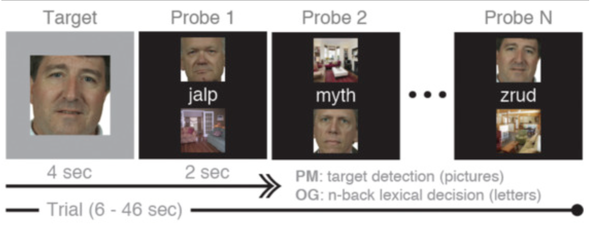

  * [Download and preprocess data](https://github.com/tientong98/utdallas_demo/blob/main/code/01_get_data_and_preprocess.ipynb)
  * [Run psychophysiological analysis](https://github.com/tientong98/utdallas_demo/blob/main/code/02_PPI.ipynb)
  * [Run beta series analysis](https://github.com/tientong98/utdallas_demo/blob/main/code/03_beta_series.ipynb)

**Link to data**: https://openneuro.org/datasets/ds001229/versions/00001

**Citation**: Lewis-Peacock, J. A., Cohen, J. D., & Norman, K. A. (2016). Neural Evidence of the Strategic Choice Between Working Memory and Episodic Memory in Prospective Remembering. Neuropsychologia. https://doi.org/10.1016/j.neuropsychologia.2016.11.006

**Task**: This dataset contains 25 subjects performing a dual-task propspective memory experiment. Participants were shown a series of words while pictures of faces and scenes were presented in the background. Participants performed an ongoing task while monitoring for a picture target (a particular face or a particular scene) to reappear. Each subject performed two versions of the task (WM-bias, EM-bias) in alternating runs of 15 trials. Each subject had 6 functional runs of 301 TRs. Between runs, participants were given a break during which the experimenter checked that the participant was comfortable and alert.

**Task diagram**: The dual-task experiment consisted a picture-target detection prospective memory task (“PM”) embedded in an ongoing lexical-decision task (“OG”). Half of the trials were WMbias trials (1-back lexical decisions and a small set of repeating homogeneous pictures) and half were EMbias trials (2-back lexical decisions and a large set of trial-unique heterogeneous pictures). Two-thirds of all trials included both tasks (“PM+OG”), and one-third did not require PM responses (“OG only”)
